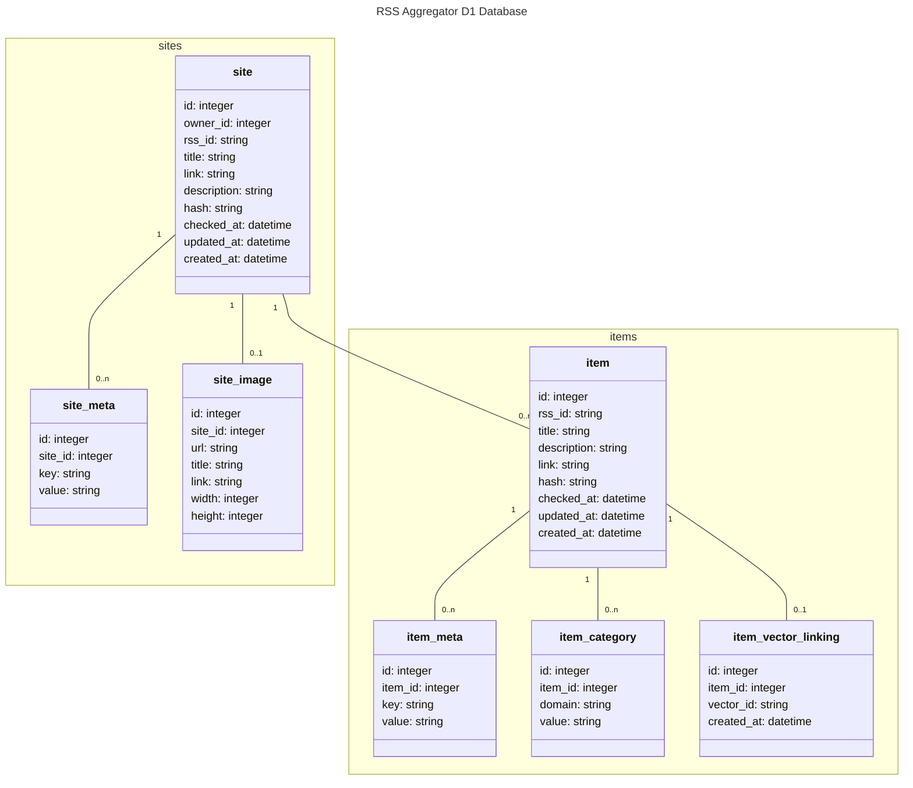

# Schema Diagram for the Database
Table names should be pluralized.  The primary key should be named `id` and be an auto-incrementing integer.

Fields should be named following the [RSS spec](https://www.rssboard.org/rss-specification) with snake_case being used for nested fields. The exception is the id field which is provided by some RSS feeds. In that case, the field should be named `rss_id`.

Hashes are used to determine if a site or item has been updated. The hash includes all of the from RSS fields and linked meta records.  The hash is generated by concatenating all of the fields and then hashing the result.  The hash is stored as a string.

## Tables
### Site
Used to store all of the sites. Fields include the [required channel elements in the RSS spec](https://www.rssboard.org/rss-specification#requiredChannelElements) plus the last time the site was checked, updated, and created. All fields are required and guaranteed to be present, else the site will not be added to the database.

### Site Meta
Used to store metadata about a site.  This is a key-value table where the key is the name of the metadata and the value is the value of the metadata. Meta data includes items specified as optional channel elements in the [RSS spec](https://www.rssboard.org/rss-specification#optionalChannelElements). It is not garanteed that all metadata will be present since different RSS feeds may not include all of the optional channel elements.  The `site_id` field is a foreign key to the `id` field in the `site` table.

### Site Image
Used to store the image for a site.  The `site_id` field is a foreign key to the `id` field in the `site` table. All fields are optional and not guaranteed to be present.

### Item
Used to store all of the items. Fields include some of the [required item elements in the RSS spec](https://www.rssboard.org/rss-specification#hrelementsOfLtitemgt) but not all plus the last time the item was checked, updated, and created. All fields are required and guaranteed to be present, else the item will not be added to the database. The `owner_id` is a foreign key for future use.

### Item Meta
Used to store metadata about an item.  This is a key-value table where the key is the name of the metadata and the value is the value of the metadata. Meta data includes items specified as optional item elements in the [RSS spec](https://www.rssboard.org/rss-specification#hrelementsOfLtitemgt), items that are required by the spec but not included in the parent record, and any other elements found in the item. It is not guaranteed that all metadata will be present since different RSS feeds may not include all of the optional item elements.  The `item_id` field is a foreign key to the `id` field in the `item` table.

### Item Category
Used to store the categories for an item.  The `item_id` field is a foreign key to the `id` field in the `item` table. All fields are optional and not guaranteed to be present.

### Item Vector Linking
Used to store the link between an item and its vector.  The `item_id` field is a foreign key to the `id` field in the `item` table. The `vector_id` field is a foreign key to the `id` field in the vector database. The `vector_id` is a UUID string. The `created_at` field is the time the link was created.

